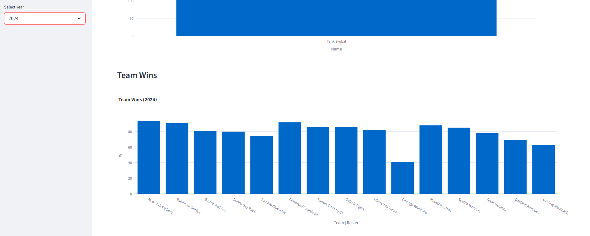

# Web Scraping MLB Dashboard

This project collects historical Major League Baseball (MLB) statistics using web scraping techniques, stores the data in a SQLite database, and visualizes the results through an interactive Streamlit dashboard.

The goal of the project is to demonstrate a complete **data pipeline workflow**:

1. Data collection (web scraping)
2. Data storage (SQLite database)
3. Data querying (SQL queries)
4. Data visualization (Streamlit dashboard)

The dashboard allows users to explore MLB historical statistics such as player home runs, batting averages, strikeouts, and team performance.

---

# Dashboard Preview



---

## Setup and Running the Project

Follow these steps to install dependencies, generate the data, and launch the dashboard.

### 1. Clone the Repository

```bash
git clone https://github.com/codedataflow/WebScrapingDashboardProject.git
cd WebScrapingDashboardProject
```

### 2. Install Required Dependencies

Install the required Python packages using the requirements file:

```bash
pip install -r requirements.txt
```

### 3. Generate the Data

Run the Python scripts in the project to scrape MLB statistics and store them in the database.

```bash
python scraper.py
python database.py
python queries.py
```

These scripts will collect MLB statistics, populate the SQLite database, and prepare the data for analysis.

### 4. Launch the Dashboard

Start the Streamlit dashboard:

```bash
streamlit run dashboard.py
```

After running the command, open the browser at:

```
http://localhost:8501
```

The interactive MLB dashboard will display charts and tables generated from the collected data.

---

# Features

- Web scraping of MLB statistics
- Structured storage using SQLite
- SQL queries for statistical analysis
- Interactive dashboard built with Streamlit
- Visualizations using Plotly
- Filter and explore historical MLB data

---

# Technologies Used

- Python
- Pandas
- SQLite
- Streamlit
- Plotly
